# WRITING

## 大作文

### 文章结构及注意事项

| 开头段 | 1~2句（最好不超过三句）                      |
| ------ | -------------------------------------------- |
| 主体段 | 如果写3段，每段3~4句，如果写2段，每段大概5句 |
| 结尾段 | 1~2句（时间不够可不写）                      |

**写作步骤**：

1. 审题
2. 想观点和写观点
3. 写开头段
4. 写主体段，每一段开头有切题的中心句，后面对其进行展开
5. 写结尾段

**文章结构**

开头：复述题目

主体：阐述观点：开头中心句+后面解释句

结尾：总结重申强调观点

**审题和写观点的方法：**ABC法

A：动作或者事件

B：A的结果（直接影响）

C：B的结果（深远的影响）

### **雅思大作文主题**

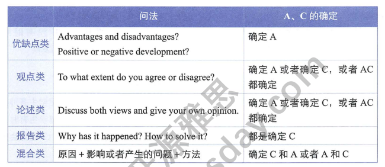

#### 优缺点类：

- 一般是确定A，分析B和C
- 好处，对谁有好处，坏处，对谁有坏处
- 有时候会对结果进行限定
- 最好折中来写，既写优点有些缺点，及主体段可以写（优点，优点，缺点）
- 主体段折中段中心句最好弱化语气

- 如果存在rather than，其前面的内容是要讨论的内容，后面的部分为对比论述

#### 观点类：

(to what extend) do you agree or disagree?

- 可以完全支持，可以完全反对；也可以部分支持，部分反对
- 有背景时如果背景时事实无需论述，若不是没有争议的事实可以讨论

- 观点存在两个命题时，赞同需要两个都支持，反对只需反对任意一个
- 观点存在as......as时，只能将前一个作为观点，后一个作为对比，如果as......as中出现了否定，则，两个都可作为观点讨论。
- 观点中存在rather than 或instead of（对比）则其前后都可当做观点来论述

#### 开头的写法

开头写两句，第一句改写题干，第二句给出自己的立场或者文章要说的内容

**第一句**

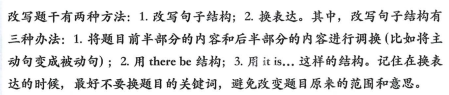

**第二句**

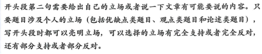

|   立场   | 表达                                                         |
| :------: | :----------------------------------------------------------- |
| 完全支持 | I strongly/completely/totally agree that...  I firmly/personally/deelpy believe that... |
| 部分支持 | I basically/largely/partly agree that ... I would argue that ... although ... I think/agree that ... although... |
| 完全反对 | I strongly/totally/completely disaggree with the idea that... I do not agree with the idea that |
| 部分反对 | I basically disagree with the idea that ... although... I do not agree/think/believe that... although... |

#### 观点的确立

大致可从以下几点确立：

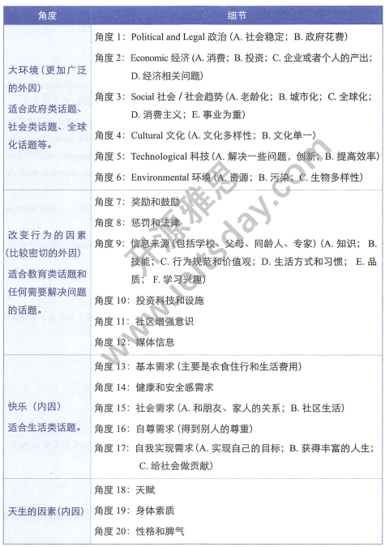

观点不可太过空泛，

比如说志愿者工作的好处，可以从个人，社会角度来分析

个人：学到了一些技能——>有利于找工作

#### 主体段的写法

观点中心句+论述中心句的句子

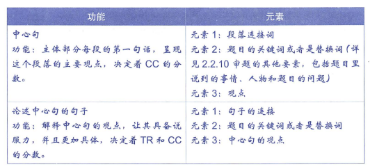

**论述的方法**

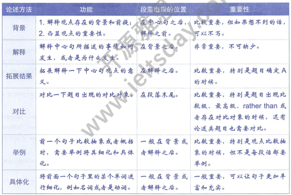

**句子的连接**

主体段句子的连接可以通过：

1. 连接词
2. 关键词或者近义词的重复
3. 代词
4. 名词性从句

#### 结尾段

一句话总结立场

或者两句话，一句总结立场，另一句总结1~2个重要观点。

#### 论述类文章的写法

论述类文章会抛出两个相反的观点some people think... some people think..... discuss both views and give your own opinion.

论述类文章结构

| 结构1                                        | 结构2                                                      |
| -------------------------------------------- | ---------------------------------------------------------- |
| 开头段                                       | 开头段                                                     |
| 主体部分第一段，解释题干的第一个立场为什么对 | 主体部分第一段，解释题干的第一个立场为什么对               |
| 主体部分第二段，解释题干的第二个立场为什么对 | 主体部分第二段，解释题干的第二个立场为什么对               |
| 无。                                         | 第三段，写出一个新的观点，In my view，解释自己支持哪个观点 |
| 结尾段，总结自己的观点立场                   | 结尾段，总结自己的观点立场                                 |

**开头段写法**

1. 改写自己支持的立场，用转折或者承接（although/while）带出相反立场
2. 改写反对立场，用转折（since）带出支持立场

#### 一些细节

1. 使用书面语
2. 不要用缩写
3. 没有第二人称，可以有we ,I，或者用he or she 代指一个人，不能只用he
4. 语法正确：逗号和副词不能连接句子，句子成分不应残缺，分清介词和连词（as是连词，with是介词），时态一致，名词单复数

#### 写长句子的方法

- 从简单句拓展

主谓宾——>主谓宾并列结构——>加状语（地点、时间、方式、频率）——>加入原因或结果——>加入对比内容（rather than, instead of, while）——>加入举例(including, such as, especially)——>某些名词增加定语从句增加信息

#### 报告类题目的写法

Why this has happened and how to improve the situation/solve it?

确定C，思考原因

- 主体段写原因和解决办法
- 避免罗列原因或者方法，要进行解释和论述

#### 注重逻辑

## 学术图表作文

### 图表写作的内容

1. 涉及数据描述

- 饼图（pie chart）
- 线图（line chart)
- 柱状图（bar chart）
- 表格（table）

2. 不涉及数据

- 流程图（flow chart）
- 地图（map）

### 分析及写作流程

1. 确定图的类型（静态 or 动态）
2. 读题确定对象，时态，对象词（数据的代词）
3. 写开头段
4. 主体段
5. 总结段

#### 确定时态

根据图表内容或者关键词

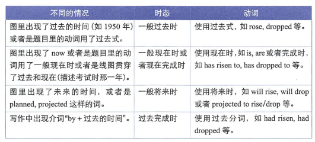

#### 对象词

amount, quantity（强调总量）

percentage, proportion（强调百分数的分子，某个整体的部分）

rate（变化的速率）

题目中给的词

百搭词 the figure for

**百分比词**

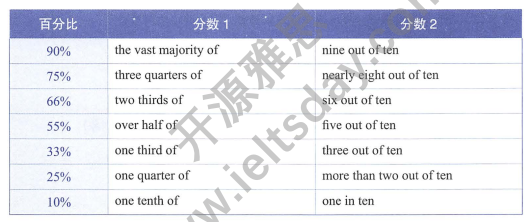

#### 开头段写法

改写题目或者表头

- 改动词

present information about

show/illustrate the changes in

show  the difference between... in...

compare ... in terms of...

- 改时间
- 改地点

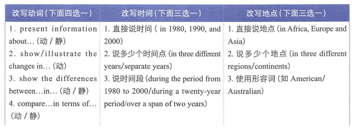

#### 结尾部分

总结非常重要，over all, to summarise, in summary

结尾不要出现数据，不要推测数据变化的原因，也不要给出建议

#### 主体部分

**如何分段**：

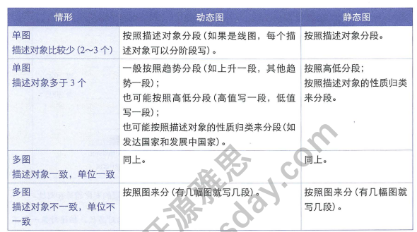

### 动态图写法

动态图趋势：

|          | 动词                                                        | 名词                     |
| -------- | ----------------------------------------------------------- | ------------------------ |
| 上升     | rose, increased,climbed  grew, jumped, surged            | rise, increase,growth    |
| 下降     | dropped, fell, declined decreased, dipped, slided        | drop, declline, decrease |
| 保持不变 | stood at, remained virtually unchanged at leveled off at |                          |

描述变化幅度：sightly, modestly, gradually, steadily, noticeably, significantly, remarkably, dramatically, rapidly, sharply, steeply

主体段分要点来写，可以分上升和下降趋势（线图），也可以分析占主要因素的属性（线图、饼图）

总结可以总结那些在上升，那些在下降

table可以转化为线图，分析趋势并且比较大小

多对象饼图时可以根据其属性进行分要点对比，分段可以根据属性的趋势

### 静态图写法

没有趋势，只有高低，涉及比较

### 注意事项

罗列数据时注意不要全部罗列完，大概在8~12个数据

数据过多时按照优先级罗列

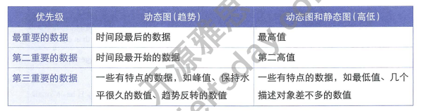

**年龄表达**

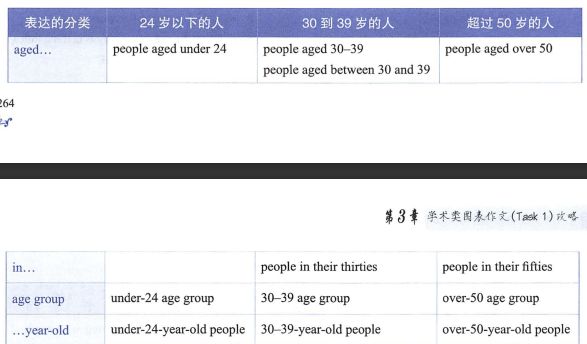

多图的时候按照图来分段

要有逻辑

### 流程图写法

flow chart 或者 process diagram

主要分为两种：

工序图，描述某类产品怎么制作，

生物生长图，描述某种生物怎么生长

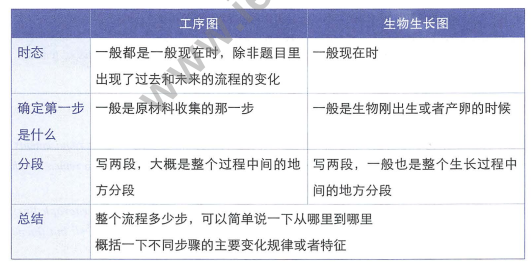

常见动词

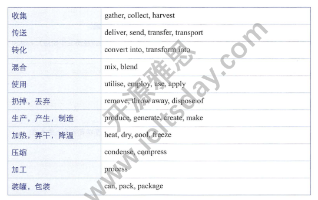

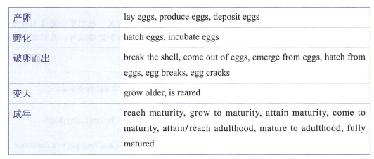

连接词

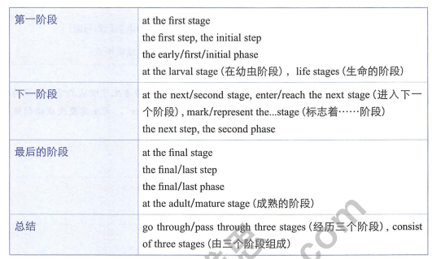

生物生长描述

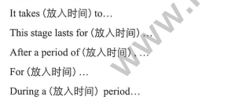

### 地图写法

注意：

时态

开始描述的地点

分段：按照时间，按照区域，按照变化，增加了什么，减少了什么，是什么以及在那些地点

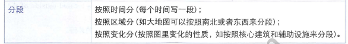

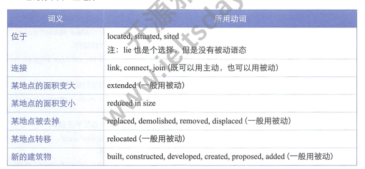

表示地理位置

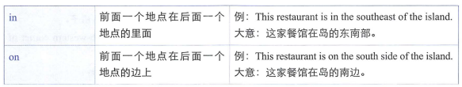

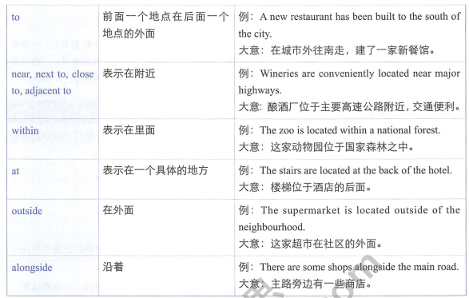

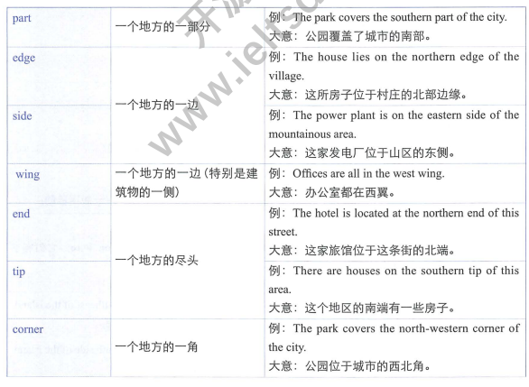

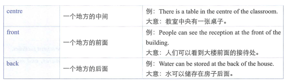

句子的变化

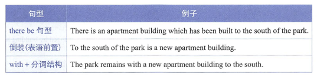

