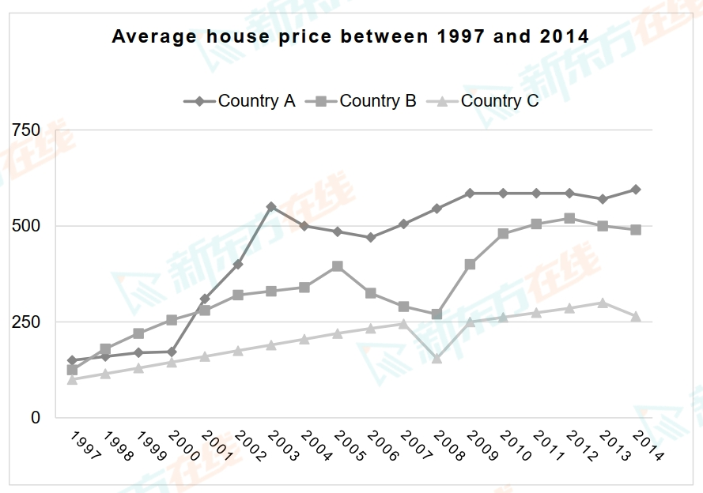

# MODEL ESSAY

## 柱状图

The bar chart presents survey results *regarding* patient satisfaction in three hospital wards *across various aspects* of the hospital experience, including hospital staff, waiting time, quality of treatment and quality of aftercare.

In summary, a larger proportion of patients in Holly Ward expressed satisfaction with the hospital experience across all four aspects. In contrast, Maple Ward had the lowest percentage of satisfied patients in three out of the four items.

In Holly Ward, *approximately* 90% of patients *held positive views regarding* hospital staff, quality of treatment and aftercare, significantly higher than those in the other wards. Waiting time, however, had a relatively lower figure in *comparison* (75%), although still 20% higher than the other two wards.

Oak Ward *followed a similar pattern*, but with smaller percentages, with 80% of patients expressing high satisfaction with the quality of treatment, around 70% for staff and aftercare, and just above 50% for waiting time.

Patients in Maple Ward, *on the other hand*, *were less content with* their hospital experience. Except that satisfaction with the quality of treatment exhibits a higher proportion (70%), roughly 50% of patients reported dissatisfaction with the other three aspects.

The bar chart gives information about three habit preferences on coffee and tea consumption in five different cities in Australia.

*Overall, it is clear that* more Australian residents preferred to go to a café for drinks in the last four weeks, while fewer consumers bought fresh coffee in the surveyed period.

It can be found that people in Sydney, Melbourne, Brisbane, and Hobart shared similar purchasing and drinking habits. *To be more specific*, the percentage of the consumers who chose to drink in the store was the largest, taking up at around 60%. 

*By contrast*, the proportion of people buying fresh coffee was generally under 45%, with Brisbane *accounting for* the least figure at 34% *approximately*. Furthermore, the results shown in Adelaide showed a different pattern from those of the former cities: half of the people drank instant coffee in the last month, while the consumers who went to a physical shop for drinks were slightly less than 50%.

## 曲线图

The graph below shows the average house price (thousand dollars) in three different countries between 1997 and 2014.

The line graph compares the average price of housing in three different countries during the period from 1997 to 2014.

Overall, it can be observed that although three countries had similar housing prices at the beginning, the gap has widened significantly by 2014, with the highest prices in Country A and the lowest in country C.

In 1997, the housing price in Country A was slightly higher than the other two nations, at approximately 150 thousand dollars compared to around 125 thousand dollars in Countries B and C. After a steady rise, the housing prices in Country A surged（go up） to over 500 thousand dollars in 2003 before experiencing a decline over the next 3 years. Ultimately, the price rose again to about 625 thousand dollars by the end of the period.

The other two countries followed a somewhat similar trend, with prices generally climbing but experiencing occasional drops. Specifically, the rise in Country B continued until 2005, before bottoming out at just over 250 thousand dollars in 2008; the price then rose, ending at 500 thousand dollars. Regarding Country C, its housing prices showed a steady increase except a decrease in 2007 and finally rose to slightly over 250 thousand dollars by 2014.

## 大作文

### phenomenon，why，how to do

**In many countries students who leave high school have no understanding of how to manage their money.** 

**Why is this case?** 
**What can be done to improve students' understanding of how to manage personal finance?** 

开头解释现象，表达观点

解释原因：教育，家庭，社会，学校，结果

可以做的措施：学校，家庭，社会

总结：做什么——>解决什么问题

*It is increasingly evident that* many high school graduates are not aware and proficient in financial management. *I believe* the absence of comprehensive（全面的） money management education and consumerism（消费主义） perpetuated by the media *are responsible for this.*

*To commence*, schools usually prioritize academic subjects over essential life skills such as financial literacy, so few relevant courses and activities are provided, leaving children ill-prepared in this area. Additionally, due to the lack of time or insight, parents seldom offer their children the opportunity to handle finances. They may fulfill any monetary request from children or restrict them from purchasing anything. In turn（thus）, children fail to learn crucial concepts such as earning, saving, and making wise shopping decisions. Furthermore, media outlets intensify（加强） these challenges by promoting materialistic values, encouraging the young to purchase trendy clothing, for example, without highlighting its potential pitfalls and thus leading to overconsumption common among young people.

*In light of these concerns*（考虑到这些问题）, there is an urgent need for structured financial management education, which requires concerted（一致的） efforts from various stakeholders（利益相关者）. Schools should ***incorporate*** financial literacy *into* the curriculum（courses）, introducing practical exercises like calculating interest rates and tracking monthly expenditures（cost） so that students will *gain fundamental financial knowledge* and *foster the habit of* budgeting and saving. Parents must *play an active role* by offering financial practices in daily life. For instance, parents can grant their children the autonomy to manage a portion（part） of family funds for a week to help children *accumulate（积累） financial experience* and raise awareness. Beyond the family unit, community organizations and financial institutions can contribute by delivering seminars（研讨会）, providing guidance for parents, or developing games that stimulate financial decision-making, *all of which complement（补充） the efforts of teachers and parents.*

In conclusion, financial management is an indispensable（不可或缺） competence for young people to acquire. While the lack of this ability *stems from*（源于） neglect by educators and parents, it can be effectively tackled（解决） through proactive（积极主动地） and strategic（有策略的） initiatives taken by key influencers.

**People continue to commit crimes even after being punished for it.** 

**Why do you think this happens?**

**How can crime be stopped?**

Nowadays, it is common that ex-offenders violate the law repeatedly although they have been punished. In this essay, I will initially discuss the reasons for this situation, followed by my suggestions which can assist in preventing crimes from happening.

There are primarily two factors largely responsible for recidivism. To commence with, the sanctions against criminals are not harsh enough. In other words, being punished does not make a huge difference to offenders, leading to the possibility that these people are normally unable to realise the detrimental consequences that breaching the law will entail for victims and society, and such behaviour is likely to be re-exhibited as a result. Additionally, former convicts are not completely accepted in society. People released from prison seem to be automatically judged as those whose character is poor. Their family and friends may not embrace them and employers refuse to recruit them. Therefore, nothing can help them to survive but to re-offend.

To cease crimes, several approaches can be adopted. Firstly, the implementation of more punitive measures is effective. Only when people are truly conscious of their wrongdoing both physically and psychologically can they stop themselves from committing crimes. For instance, a longer stint of community service or jail sentence is respectively appropriate for convicts with minor crimes and serious ones. Secondly, providing more vocational training sessions and job opportunities for those with criminal records is another feasible solution. If they can earn a living independently, having sufficient money to afford accommodation and feed themselves, they are rarely motivated to participate in some illegal activities again.

In conclusion, lenient punishments for law breakers and less social tolerance for previous criminals are the two major two causes of re-offending. However, if severer penalties can be meted out to prisoners and meanwhile ex-criminals are allowed to have a smoother re-entry into the community, crime issues can be tackled.

### agree or disagree

**Some people say that the increasing use of computers and mobile phones for communication has had a negative effect on young people’s reading and writing skills.** 

**To what extent do you agree or disagree?**

There are those who opine that young people’s literacy skills have been detrimentally impacted due to their excessive reliance on electronic communication. Personally, I totally agree with this statement because opportunities are seldom provided for them to correct their mistakes and their exposure to informal language is excessive.

The primary reason supporting my stance is that young people are prevented from developing the ability to realise their spelling and grammatical mistakes. When they communicate via user-friendly devices, the advanced computer system will automatically give assistance by checking and correcting the mistakes made, resulting in these individuals never attaching importance to the errors at all. Thus, they will end up repeating the same mistakes and their reading and writing skills are threatened.

Another important point I consider relevant is that young people frequently use casual expressions on their computers and smart phones, including “CU29t”, “LoL” and “dunno”. Although this approach allows them to communicate with great convenience, they will gradually become accustomed to using these words. If they were required to generate some formal writing pieces, they would have difficulty accomplishing such tasks because of their inability to select appropriate vocabulary and sentence patterns.

In conclusion, I reiterate my complete approval of the idea that communication by using computers and mobiles poses a threat to young people’s writing and reading skills. For one thing, they do not know what spelling or grammar mistakes they are making and how to write appropriately, and for another, they frequently use informal language. Therefore, it is suggested that the young not only enjoy the convenience brought by electronic communication but also spend time learning vocabulary and grammar rules as well as practising different writing genres.

**It was predicted that with the development of technology, people would have more free time in 21st century.** 

**To what extent do you think the prediction has come true?** 

One of the predicted benefits of technological progress in the 21st century was that people would have more free time. While there is no doubt that technology has facilitated automation of many tasks and productivity increase, it is also clear that this has not necessarily translated into more leisure time for individuals.

On the one hand, it is true that technology has revolutionized many aspects of our lives and has allowed us to complete tasks more quickly and easily. In agriculture, for example, the use of machines has dramatically increased efficiency, meaning that farmers can produce more food in less time than ever before. Similarly, the rise of the internet and digital communication tools and the improvements of transportation have enabled us to work from anywhere, reducing the amount of time we need to spend commuting to and from an office. These technological advancements have undoubtedly saved time and make us more productive.

On the other hand, the same technological advancements have also led to an increase in the demands on our time. The availability of digital devices and the internet means that we are always connected and always "on" regardless of locations and time zones. Employees are often required to be available outside of traditional working hours in sacrifice of their free time. Additionally, machines have been replacing human workers in almost every area, which has led to intense competition in the labour market. People thus have to spend more time learning and honing new skills to secure their jobs or they have to work extended hours doing part-time jobs to make ends meet.

In conclusion, while technology has undoubtedly given rise to greater efficiency and productivity in many areas of life, it has not led to more leisure time. Instead, the demands on our time have simply shifted and changed, and it is up to us as individuals to find ways to balance work and leisure time in this increasingly connected and competitive world.

**Some people say that it is a waste of time to plan for the future and that it is more important to focus on the present.** 

**To what extend do you agree or disagree?**

In a world that often encourages individuals to plan for the future, it is argued by some people that the present moment should take precedence. I personally believe living in the present is undoubtedly paramount, but this does not diminish the significance of planning.

To be present is to be attentive and appreciative. Focusing on the moment allows individuals to absorb knowledge, enhance skills and commit to the ongoing work or study, better preparing them for unforeseen opportunities. Scientific achievements often result from persistent dedication to a singular objective rather than meticulous planning or gambling on the most promising path. Mindfulness of the present also foster awareness, enabling individuals to enjoy the current moment instead of dwelling on past failures or stumbling to the fear of future. This reduction of unnecessary worries promotes mental well-being, leading to great happiness and the appreciation of one’s surroundings.

Planning, functioning as a roadmap, instills confidence in facing uncertainties that no one can predict and give a clearer idea of what lies ahead. Whether for individuals or organizations, planning is indispensable for career or business development as well as financial allocation. The process of creating plans empowers them to take control and initiatives, making informed choices and decisions instead of leaving things to chance or external factors. Additionally, planning allows for the refinement and evaluation of goals, breaking them into smaller, manageable objectives. Just as projects rely on plans to progress and succeed, plans enhance efficiency and reduce wastes of resources, talents and time, enabling people to reach their desired destination.

In conclusion, both strategic foresight and living in the present offer unique advantages and the synergy of these two perspectives allows individuals to derive fulfillment from the richness of the present while preparing wisely for what lies ahead. Thus, the key to a holistic and meaningful life is to strike a nuanced balance between them.

### discuss both views

**Some people believe that every human can create art. Other people think that art can only be created by people with special talents.** 

**Discuss both views and give your opinion.** 

Art, in its myriad forms, serves as a reflection of human expression, creativity, and culture. “Everyone can be an artist” has been a rallying cry gaining increasing popularity in recent years. Yet it has long been a subject of debate regarding whether art creation is within the reach of ordinary people or requires a unique talent.

Proponents of the belief that artistry is reserved for the talented emphasize the exceptional skills renowned artists demonstrate. When looking at the timeless masterpieces passed down through generations, few would deny the talent and ingenuity involved. Be it the symphonies of Mozart or Beethoven or the paintings of Monet or Van Gogh, to achieve such excellence undoubtedly demands years of dedicated practice, alongside an innate, natural gift. Even in contemporary art, it is not hard to find the level of professionalism that eludes the average person.

On the other hand, advocates for the notion that art is accessible to all emphasize the importance of creativity in the artistic process. Individuals can harness their creativity to innovate and create anew, which lies at the heart of art. Just as a delivery boy in China who wrote and published poems to record his thoughts, observations and emotions of his work and life, anyone can explore their interests and be creative, whether it is through poetry, painting, music or other forms. While these pursuits all require some basic skills, they are not insurmountably complex and are fueled by passion and perseverance.

In my opinion, the crux of the matter lies in how one understands art. Its multifaceted nature and expansive definition lead to divergent perspectives. While I acknowledge that certain talents might be necessary to produce works with commercial value or gain approval from experts, I contend that anyone capable of generating something new can indeed be considered an artist.

### better or not, similar to section 2

**More and more people move from the countryside to big cities.**

**Does this development bring more advantages or disadvantages to the environment?**

Nowadays, a growing proportion of rural residents are leaving their homes for large metropolises. Personally, I am inclined to the view that the drawbacks of this trend to the environment prevail over the benefits.

The key disadvantage is the deteriorating air quality in major cities. With more people pouring into and settling down in these places, the likelihood of them purchasing private vehicles that rely heavily on fossil fuels will be high. However, the consumption of these energy resources may well lead to excessive emissions of toxic fumes, including sulphur dioxide and consequently, air pollution will become an issue.

Another downside is that biodiversity will be threatened. The rapid expansion of cities occupies a great amount of land for the construction of multifarious types of infrastructure, such as airports, roads, shopping malls, and residential blocks, but a wide range of species of flora and fauna will become extinct during the process because their habitats are damaged. As a result, there will be fewer types of animals and plants on the Earth.

However, the advantages of more rural people relocating to megacities over the environment are worth considering, one of which is that the innovation of technology regarding environmental protection will be encouraged. Having realised the detrimental effects of human behaviour on the environment, scientists are endeavouring to experiment with environmentally friendly ways humans can develop. This can tackle the current challenges people are encountering and benefit future generations as well.

In conclusion, I agree that there are more negative outcomes than positive ones in terms of the environment if more and more individuals from the countryside migrate to metropolitan areas. Although inventing new technologies can be the solution to environmental issues, in my opinion, serious air pollution and the damage to biodiversity in cities are still major concerns at the moment. Therefore, experts should accelerate the progress of technology development to simultaneously ensure human advancement and environmental conservation.

